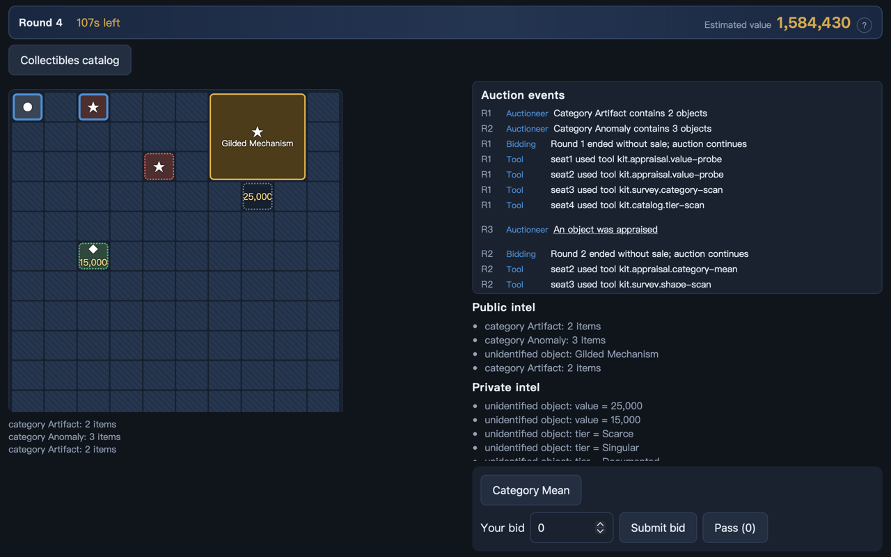

<div align="center">

# 奇局 Qiju

[English](./README.md) | 简体中文

**四位买家，一箱来历不明的藏品，谁都不知道里面究竟是什么。**

### 🎲 [立即游玩 →](https://qijugame.com)

免注册，打开浏览器就能玩，一局大约五分钟。



</div>

---

## 这是什么

一只封箱的藏品柜将被整体拍卖。里面塞着一堆杂物——金色锦鲤雕像、破损的剑柄、
一瓶莫名其妙的空气清新剂，还有几件谁也没认出来的东西。有的价值连城，
但大多数不值几个钱。

你只能拿到**碎片**。你的分析员会揭示几个轮廓，或者某个类别，又或者一件藏品的
准确价格。你的工具可以再探一点。四个人看到的是**完全不同的局部真相**——而且
每次使用工具都会**公开广播**，所以对手选择去查什么，本身就是情报。

然后你在纸条上写下一个数字，封好，交上去。

## 怎么玩

你竞拍的是**整箱**，不是单件。初始预算 **2,000,000**。

**五个回合的密封出价**，所有人同时出价，互相看不见。

想在早期回合就拿下，你必须**远远压过**所有人——藏品柜只有在有人愿意大幅溢价时
才会提前易主：

| 回合 | 出价需高于第二名的…… |
|:---:|---|
| 1 | **2 倍** |
| 2 | **1.6 倍** |
| 3 | **1.3 倍** |
| 4 | **1.1 倍** |
| 5 | 只需**最高**即可，终局 |

第 5 回合若出现平价则进入加时；再次平价则**流拍**，所有人空手而归。

每个回合之间都会有新情报进来。出手太早是在猜，等得太久会被人截胡。
**用低于其真实价值的钱拿下整箱**——这就是全部的游戏。

## 你的分析员

开局前选一位，每位看到的局部都不一样。

| 分析员 | 揭示内容 |
|---|---|
| **测绘员** | 4 个随机未知格位的轮廓 |
| **编目员** | 3 个格位的类别；第 3 回合鉴定 1 件身份 |
| **统计员** | 2 个随机品级的精确件数；第 4 回合揭示某类别的平均价值 |
| **估价师** | 开局 1 件的精确价值；第 2、4 回合各揭示 2 个新品级 |

## 你的工具包

选一个工具包，共两次使用机会，用在刀刃上——每次使用都会被公开。

| 工具包 | 包含工具 |
|---|---|
| **测绘包** | 轮廓扫描、类别扫描 |
| **编目包** | 品级扫描、身份鉴定 |
| **估价包** | 价值探针、类别均值 |

## 与 AI 对战

四个内置 AI 可以凑满一桌。它们是**确定性**的——同一个种子会逐步复现同一局，
所以离谱的翻车可以复盘，争议可以对账。

你也可以纯粹**观战**：看四个 AI 互相厮杀，支持单步或 8 倍速播放。

---

<details>
<summary><b>自托管与开发</b></summary>

### 快速开始

```bash
pnpm install
pnpm build
node apps/server/dist/main.js
```

打开 `http://localhost:3000`。

本地开发（两个终端，带热更新）：

```bash
pnpm dev:server    # tsx watch，http://localhost:3000
pnpm dev:web       # vite dev，http://localhost:5173，代理 /api 到 :3000
```

### 架构

pnpm workspace 单仓：

```
qiju/
├── apps/
│   ├── web/                React + Vite 客户端（可作为静态 SPA 部署）
│   ├── server/             Fastify HTTP + WebSocket 权威游戏服务器
│   └── arena/              离线批量模拟与 AI 基准测试 CLI
└── packages/
    ├── game-core/          纯确定性状态机（无 I/O、无时钟、无 RNG 副作用）
    ├── content-demo/       藏品目录、价值区间、本地化文案
    ├── rules-demo/         规则包编译与估值引擎
    ├── agents/             内置确定性 AI
    ├── session-runtime/    内存房间执行器、时钟抽象、AI 编排
    ├── contracts/          共享协议类型（zod schema）
    └── test-kit/           共享测试夹具
```

服务端是权威的，绝不会把某个席位不该看到的信息发给它——隐藏的藏品价值在
**网络层就被裁掉**，而不是仅仅在界面上藏起来。

对局状态完全存在服务器内存里，没有数据库。重启会丢掉进行中的对局，
这是刻意的范围取舍。

### 环境变量

| 变量 | 位置 | 默认 | 说明 |
|---|---|---|---|
| `PORT` | server | `3000` | HTTP/WS 监听端口 |
| `HOST` | server | `0.0.0.0` | 监听地址 |
| `NODE_ENV` | server | `development` | `production` 启用 `Secure`/`SameSite=None` cookie，并要求 `COOKIE_SECRET` |
| `COOKIE_SECRET` | server | — | 生产必填，用于签名访客会话 cookie |
| `CORS_ORIGIN` | server | 未设（不限制） | 跨域部署时允许的前端来源，逗号分隔 |
| `COOKIE_DOMAIN` | server | 未设（仅当前主机） | 前后端共享的父域名 |
| `DATA_DIR` | server | `data` | Arena 报告输出目录 |
| `LOG_LEVEL` | server | `info` | 日志级别 |
| `ALLOW_FIXED_SEED` | server | `true` | 允许客户端指定可复现种子 |
| `VITE_API_URL` | web（构建期） | 未设（相对路径） | 跨域部署时的后端地址 |

### 部署

按前后端分离设计：静态前端放边缘 CDN，有状态的 Node 后端放真实计算主机。

**前端（`apps/web`）→ Cloudflare Pages**（或任意静态托管）
- 构建命令：`pnpm --filter @qiju/web... run build`
- 输出目录：`apps/web/dist`
- 设置 `VITE_API_URL` 指向后端公开地址。

**后端（`apps/server`）→ Railway**（或任意支持 Node 的主机——Fastify + WebSocket
需要常驻进程，无法直接跑在静态托管或标准边缘/Workers 运行时上）。
参见 [`apps/server/railway.toml`](./apps/server/railway.toml)。

仓库内**没有任何硬编码域名**，全部通过构建/部署期环境变量注入。

### 测试

```bash
pnpm lint
pnpm typecheck
pnpm test
pnpm test:integration
pnpm arena:smoke     # 1000 局固定种子 AI 冒烟
pnpm build
pnpm test:e2e        # Playwright，需先 pnpm build
```

</details>

## 关于本项目

奇局是一个同人性质的非商业业余项目，是对密封竞价玩法的一次原创演绎，
从零写起。所有藏品、文案、美术与经济系统均为原创或程序化生成，
与任何公司或作品没有隶属或授权关系。

这是个人项目而非受支持的产品：欢迎提 bug 和小修复，
但大型功能需求大概率不会被采纳。线上 Demo 跑在业余级托管上、
对局状态仅存于内存，偶尔重启属于正常现象。

## 许可证

MIT，见 [LICENSE](./LICENSE)。覆盖整个项目；不含任何第三方美术、音频或字体资源。
